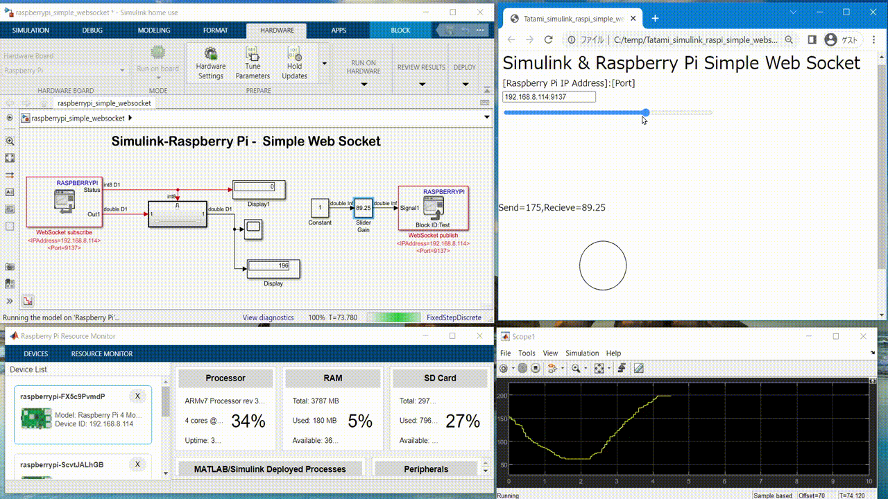

# Simulink-Raspberry Pi -  Simple Web Socket Example
Web-based UI example using WebSocket+P5js .  

# Tool Requirements
## MATLAB/Simulink
- MATLAB 2019B or later
- Simulink
## Add on Package
- Simulink Support Package for Raspberry Pi Hardware

